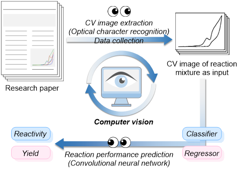
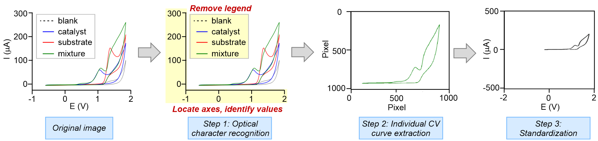
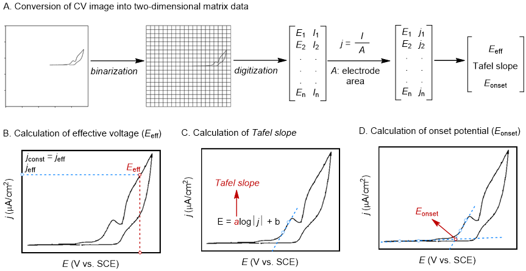

# CV-CNN
This is a repository for predicting electro-organic reaction performance using cyclic voltammogram (CV) images as learning material with convolutional neural network (CNN). 

Since raw cyclic voltammetry data points are rarely disclosed, the repository also provides a tool for extracting individual CV curves from published figures. 
The curated dataset comprises 150 CVs corresponding to 50 individual reactions, each represented by a mixture CV, a substrate CV, and a catalyst CV. Plural-view strategy is employed for the reactivity calssification (`Autoencoder_CNN_classification.ipynb`). and reactions with yield below 10% were labelled as unreactive.

We also carried out separate regression tasks for different metals, starting from cobalt catalysis, which constitutes the largest proportion of the collected dataset (`CV_CNN_regression.ipynb`).

  

<i>Figure 1. Combining CV images and convolutional neural network for electro-organic reaction performance prediction.</i>

## Data collection
The data curation is completed with a single CV profile extraction tool (`individual_CV_extraction.ipynb`). The workflow is as follows:

1. **Axis detection and normalization**: OCR is used to locate the current and voltage axes, identify scale values for normalization, and remove irrelevant legends.  
2. **Redox profile isolation**: The target CV curve is extracted by specifying its HSV (hue–saturation–value) range.  
3. **Standardization**: Each extracted single curve is standardized to unified current (-500 to 500 μA) and voltage (-2.0 to 2.0 V vs. SCE) scales, using the scale values recorded in step 1.

  

<i>Figure 2. Illustration of individual CV profile extraction.</i>

## Convert CV image into electro-descriptors
To compared image-based modelling with descriptor-based prediction, we test the strategy in paper entitled "Electro-Descriptors for the Performance Prediction of Electro-Organic Synthesis". The calculation of electro-descriptors, including onset potential, effective voltage and tafel slope is realized by binarizing the CV image and converting it into matrix data. The pixel coordinates corresponding to the CV curve are subsequently mapped into electrochemical quantities, where the x-axis pixels are converted into potential values (V vs. SCE), while the y-axis pixels are converted into current (mA). The working electrode area (cm2) reported in each publication was collected to facilitate the conversion of current into current density (mA/cm2). The CV working electrode diameter, reaction working electrode area and reaction constant current that are necessary for calculating the electro-descriptors are included in the (`electro-descriptors.csv`). A convert example is given in (`Calculate_electro_desc_example.ipynb`).

  

<i>Figure 3. Illustration of converting CV image into electro-descriptors.</i>

# Dependence
| Package      | Version |
| ------------ | ------- |
| scikit-image | 0.25.2  |
| Pillow (PIL) | 11.3.0  |
| numpy        | 1.26.4  |
| pytesseract  | 0.3.10  |
| matplotlib   | 3.8.0   |
| torch        | 2.2.2   |
| pandas       | 2.1.4   |
| scikit-learn | 1.3.0   |
| scipy        | 1.11.4  |
